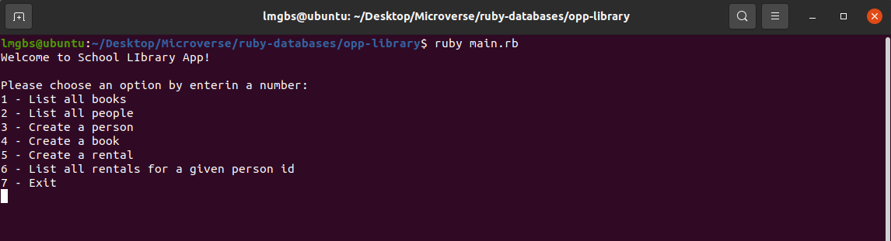

# OPP Library

Object Oriented Programming built with Ruby to run in the terminal

## Built With

## Getting Started

To get a local copy up and running follow these simple example steps in your terminal.

- `git clone https://github.com/Leandro-Barretoo/opp-library`
- `cd opp-library`
- `ruby main.rb`

## Instructions

1. To start the game, type `ruby main.rb`
2. Chose any option you like and try to register new people and books

## Authors

👤 **Leandro Barretoo**

- GitHub: [@Leandro-Barretoo](https://github.com/Leandro-Barretoo)
- Twitter: [@Leandro74972596](https://twitter.com/Leandro74972596)
- LinkedIn: [LinkedIn](https://www.linkedin.com/in/leandro-miguel-gon%C3%A7alves-barreto-7079b11ba/)

## 🤝 Contributing

Contributions, issues, and feature requests are welcome!

## Show your support

Give a ⭐️ if you like this project!

## 📝 License

This project is [MIT](./MIT.md) licensed.
